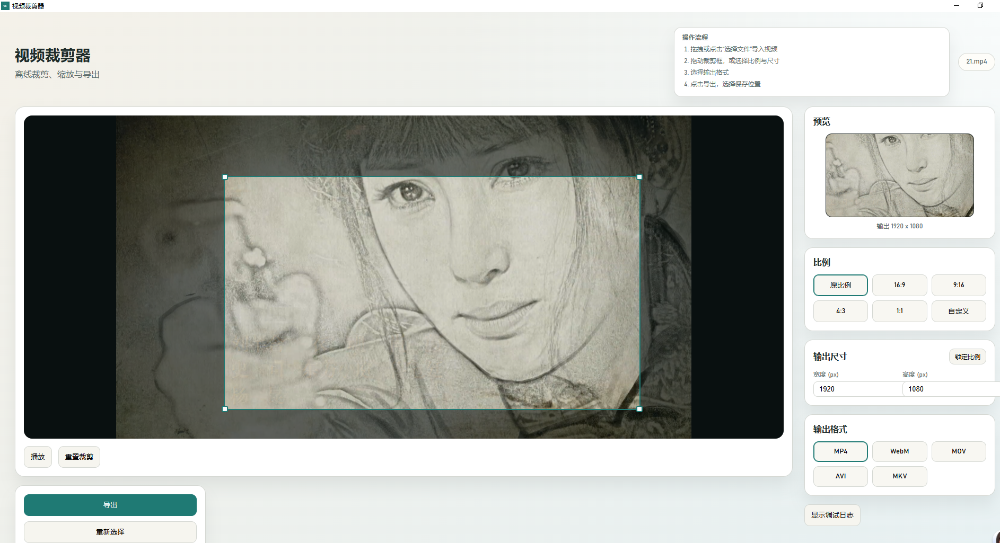

# Video Cropper (Windows, Offline)

Offline desktop video cropper with a visual crop box, real-time preview, and
FFmpeg export. Built with Rust + Tauri v2.



## Features
- Drag-and-drop or open file
- Visual crop box with fixed ratios or custom ratio
- Live preview of the cropped output
- Export to MP4, WebM, MOV, AVI, MKV

## Requirements
- Rust toolchain
- Tauri CLI v2 (`cargo install tauri-cli --locked`)
- FFmpeg executable (see below)

## Run (dev)
From the project root:
```bash
cargo tauri dev
```

## Build (Windows)
From the project root:
```bash
cargo tauri build
```

## FFmpeg setup
The app looks for FFmpeg in this order:
1. `FFMPEG_PATH` environment variable (full path to `ffmpeg.exe`)
2. Bundled resource: `resources/bin/ffmpeg.exe`
3. Next to the app: `ffmpeg.exe` or `ffmpeg-x86_64-pc-windows-msvc.exe`
4. `bin/` folder near the app (searches up to 5 parent directories)
5. `ffmpeg` on PATH

To bundle FFmpeg with the app, place it here in the repo:
```
bin/ffmpeg.exe
```
Tauri copies it into the app resources as `bin/ffmpeg.exe`.
